# Number Guessing

(Developer: Robin Bosch)


[View live site](https://ci-pp3-number-guessing.herokuapp.com/)

## Table of Contents

1. [About](#about)
2. [Project Goals](#project-goals)
    1. [User Goals](#user-goals)
    2. [Site Owner Goals](#site-owner-goals)
3. [User Experience](#user-experience)
    1. [Target Audience](#target-audience)
    2. [User Requirements and Expectations](#user-requirements-and-expectations)
    3. [User Stories](#user-stories)
    4. [User Manual - How to play](#user-manual---how-to-play)
4. [Technical Design](#technical-design)
    1. [Flowchart](#flowchart)
    2. [Data Models](#data-models)
5. [Features](#features)
6. [Technologies Used](#technologies-used)
    1. [Languages](#languages)
    2. [Libraries](#libraries)
    3. [Tools](#tools)
7. [Validation and Testing](#validation-and-testing)
    1. [Python Validation](#python-validation)
    2. [Testing user stories](#testing-user-stories)
8. [Bugs](#bugs)
9. [Deployment](#deployment)
10. [Credits](#credits)
    1. [Code](#code)
    2. [Acknowledgements](#acknowledgements)
11. [License](#license)

## About

Number Guessing is a small game where the user or computer guesses a random number. The user can plays against the computer. The user logs in to the app and is remembered by username and email. There are several difficulties and the user can create their own difficulties.

## Project Goals

### User Goals

- Play a fun little game
- Be able to change the difficulty
- Being able to login or register
- Winning

### Site Owner Goals

- Offer a fun game
- Make sure that the user understands the rules
- Give the user the possibility to customise their game

## User Experience

### Target Audience

- Everyone who wants to play a little game
- People who want a simple game

### User Requirements and Expectations

- Easy to navigate
- Can complete multiple games
- Allows for customization in the settings

### User Stories

As a user I want to:

1. Start a game
2. Know the rules
3. Want to get some help
4. Play as guesser
5. Let the computer guess
6. Register myself
7. Login
8. Change my username
9. Set the difficulty
10. Create my own difficulty

### User Manual - How to Play

#### Navigation

Navigation works by selecting the number of the option available

#### Read rules and help

The rules and help page can be accessed in the main menu

#### Login

The login screen appears when accessing the game start or the settings
Choose Login if you are already registered otherwise choose register and enter your email address and preferred username
The default difficulty is set to easy and can be changed in the settings

#### Settings

The settings can be accessed from the main menu
You can change the username, the current difficulty or manage your custom difficulties

#### Custom difficulty

You can set your own difficulty for more variety. You can set the minimum and maximum number and the amount of rounds.
You can create and delete your custom difficulties. Don't forget to select your custom difficulty before playing.

#### How to Play

Select Start game and login if necessary.
Select your preferred game type.

User guesses game:  
The computer chooses a random number within the minimum and maximum range.
You as the user have to guess this number, but you only have a limited amount of guesses.
After every guess the computer gives you a hint if the number is lower or higher and you can guess again.
If you get the number within the limited rounds you win. If you don't get it in time the computer wins.

Computer guesses game:  
The game is flipped. You select your random number within the minimum and maximum range.
The computer tries to guess your number and you have to confirm or deny if the number is correct.
You need to give the computer a hint after every guess. Tell the computer if your number is lower or higher.
If the computer gets your number within the limited rounds, the computer wins. If the computer can't guess the number in time, you win!
Don't lie to the computer if it gets your number though!

## Technical Design

### Flowchart

The following flowchart shows the structure and logic of the Number Guessing app.

<details><summary>Open flowchart</summary>
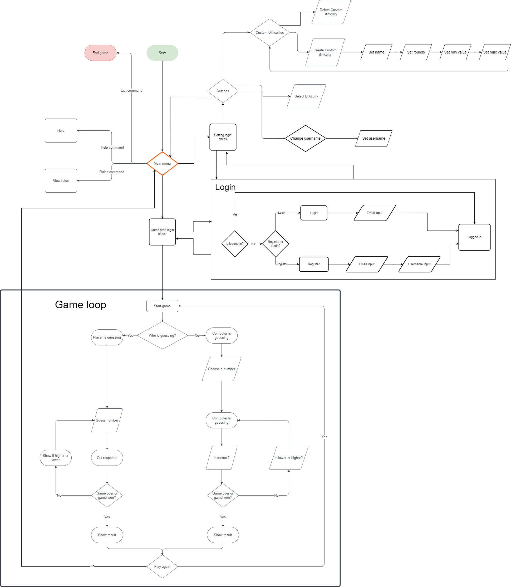
</details>

### Data Models

This project is structured into several different modules that can be imported
with the following folder structure:

- classes
- utils

Utils contain function packages

The following classes are available:

- Game (abstract)
  - UserGuessingGame
  - ComputerGuessingGame
- User
- Difficulty
  - CustomDifficulty

A Guesser Enum is available to determine Guesser type game.

The navigation is done by calling different menus. The game is packaged into one object which then runs itself to the end.

## Features

The app has 9 features in total

### Main menu

- Shows the main menu
- Contains the following options:
    - Start game
    - Rules
    - Help
    - Settings
    - Exit
- User stories covered: 1, 2, 3

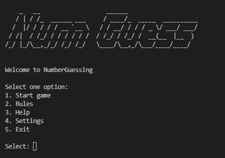

### Rules page

- Shows the rules
- Directly accessible from the main menu
- Navigates back to the main menu
- User stories covered: 2

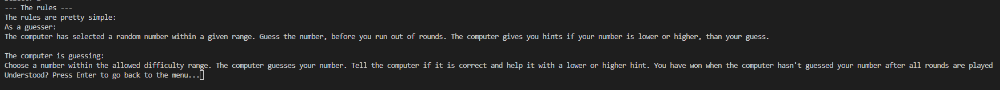

### Help page

- Shows the help
- Directly accessible from the main menu
- Navigates back to the main menu
- User stories covered: 3

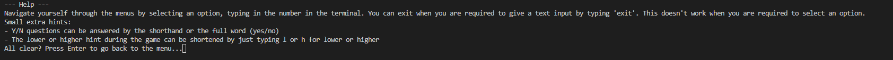

### Login menu

- Shows the login and register options
- Allows the user to register
- User stories covered: 6, 7

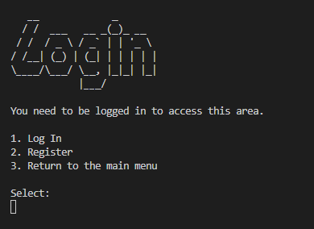

### Settings menu

- Shows the settings available
- Allows the change of the username, managing of the custom difficulties and change the difficulty
- User stories covered: 8, 9, 10

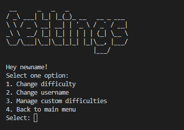

### Manage custom difficulties

- Allows for creating and deleting custom difficulties 
- Lists all custom difficulties
- User stories covered: 10

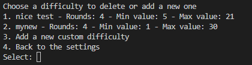

### Game start

- Shows game start
- Choose between the two game types: User guesses, Computer guesses
- User stories covered: 1, 4, 5

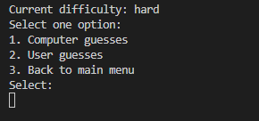

### Game computer guessing

- User sets a random number
- Computer guesses number
- User gives hint to computer
- User stories covered: 5

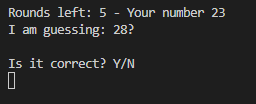

### Game user guessing

- Computer sets a random number
- User guesses number
- Computer gives hint to user
- User stories covered: 4

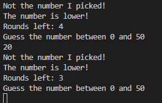

## Technologies Used

### Languages

- Python

### Libraries

- [gspread](https://docs.gspread.org/en/latest/) - To manage the spreadsheet
- [google oauth](https://google-auth.readthedocs.io/en/master/) - To connect to the google drive

### Tools

- Git
- GitHub
- Heroku - to deploy the app
- Pycodestyle - for validation
- Diagrams.net - for the flowchart
- [Regex101](https://regex101.com/) - to test regex expressions

## Validation and Testing

### Python Validation

Python validation was done with pycodestyle linter
The linter showed no errors or other problems

#### Python validation locally

1. Install pycodestyle

```python
pip3 install pycodestyle
```

2. Select pycodestyle as linter

<details>
 <summary>Screenshot from console</summary>
 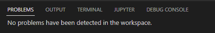
</details>

### Testing user stories

#### As a user I want to

1. Start a game

|Feature|Action|Expected result|Actual result|
|---|---|---|---|
Start game option|Select option 1 in the start menu and login if necessary|Game starts|Works as expected|

2. Know the rules

|Feature|Action|Expected result|Actual result|
|---|---|---|---|
Rules page|Select option 2 in the start menu|Shows the rules|Works as expected|

3. Want to get some help

|Feature|Action|Expected result|Actual result|
|---|---|---|---|
Help page|Select option 3 in the start menu|Shows the help|Works as expected|

4. Play as guesser

|Feature|Action|Expected result|Actual result|
|---|---|---|---|
Selecting user guesser at game start|Choose option 2 at the start of the game|Starts the with user as guesser|Works as expected|

5. Let the computer guess

|Feature|Action|Expected result|Actual result|
|---|---|---|---|
Selecting computer guesser at game start|Choose option 1 at the start of the game|Starts the with computer as guesser|Works as expected|

6. Register myself

|Feature|Action|Expected result|Actual result|
|---|---|---|---|
Register|Choose register in the login screen|Registers the user|Works as expected|

7. Login

|Feature|Action|Expected result|Actual result|
|---|---|---|---|
Login|Choose login in the login screen|Logs in the user|Works as expected|

8. Change my username

|Feature|Action|Expected result|Actual result|
|---|---|---|---|
Change username option in settings|Navigate to the settings and choose the change username option in the settings|Allows the user to change the username|Works as expected|

9. Set the difficulty

|Feature|Action|Expected result|Actual result|
|---|---|---|---|
Change difficulty in the settings|Navigate to the settings and choose the change difficulty option|Changes the difficulty|Works as expected|

10. Create my own difficulty

|Feature|Action|Expected result|Actual result|
|---|---|---|---|
Add custom difficulty|Navigate to the settings and choose manage custom difficulties and then the add option|Adds a new custom difficulty|Works as expected|

## Bugs

|Status|Bug|Fix|
|---|---|---|
|Fixed|The game crashes with a custom difficulty|Data type was incorrect when reading from the spreadsheet, type safety has been added to the difficulty class and type conversion when reading from the spreadsheet|
|Fixed|Incorrect message when the computer ran out of rounds when guessing and lost the game|Swapped the user_won boolean to False|

## Deployment

Heroku:

1. Create an account at Heroku and login.
2. Click the "Create new app" button on your dashboard, add app name and region.
3. Click on the "Create app" button.
4. Click on the "Settings" tab.
5. Under "Config Vars" click "Reveal Config Vars" add your credentials as value with "CREDS" as key.
6. Under "Buildpacks" click "Add buildpack" and then choose "Python" first and click "Save changes"
7. Add a second buildpack "nodejs" and click "Save changes"
8. Go to the "Deploy" tab and choose GitHub as your deployment method
9. Connect your GitHub account
10. Enter your repository name, search for it and click connect when it appears below.
11. In the manual deploy section click "Deploy branch"
12. Optional: You can enable automatic deploys if you want the app to automatically update

You can fork the repository by following these steps:

1. Go to the repository on GitHub  
2. Click on the "Fork" button in the upper right hand corner

You can clone the repository by following these steps:

1. Go to the repository on GitHub
2. Locate the "Code" button above the list of files and click it  
3. Select if you prefer to clone using HTTPS, SSH, or Github CLI and click the "copy" button to copy the URL to your clipboard
4. Open Git Bash
5. Change the current working directory to the one where you want the cloned directory
6. Type git clone and paste the URL from the clipboard ($ git clone <https://github.com/YOUR-USERNAME/YOUR-REPOSITORY>)  
7. Press Enter to create your local clone.

## Credits

### Code

- [ASCII art generator](http://patorjk.com/software/taag/)
- [Console clear function](https://stackoverflow.com/questions/517970/how-to-clear-the-interpreter-console)

### Acknowledgements

- A special thanks to my mentor Mo Shami for his feedback and advice, especially on the documentation.
- A thanks to the Code Institute for the great learning resources

## License

This project is published under the MIT license.  
[License](/LICENSE.txt)
